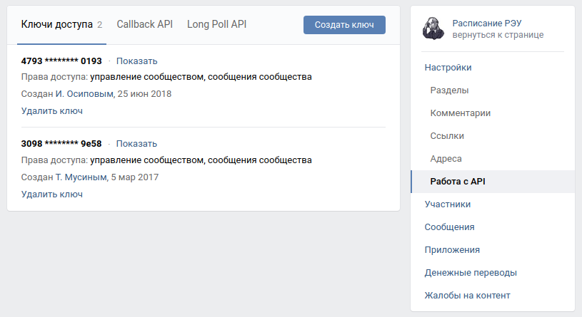

# Бот для проведения викторин

Скрипт позволяет автоматизировать проведение викторин.

Бот анализирует ответ пользователя и позволяет ему сдаться, чтобы узнать правильный ответ.
Также есть возможность узнать свой счет.

Вопросы к викторине хранятся в базе `Redis`

Проект реализован для двух социальных сетей:

- [Telegram](https://web.telegram.org/)
- [VK](https://vk.com/)


## Как запустить

- Скачайте код:
```shell
$ git clone https://github.com/Alex-Men-VL/notification_bot.git
$ cd notification_bot
```
- Установите зависимости:
```shell
$ pip install -r requirements.txt
```
- Запустите бота в Telegram:
```shell
$ python3 start_tg_bot.py
```
- Запустите бота в VK:
```shell
$ python3 start_vk_bot.py
```

## Как добавить вопросы в Redis

- Запустите скрипт командой
```shell
$ python3 load_quiz_questions.py --path <путь к папке с вопросами>
```

Дефолтный путь к папке с вопросами: `quiz_questions` - папка в корне проекта.

Файл с вопросами должен быть формата `.txt`.
Документ должен быть следующего вида:
```text
Вопрос:
Текст вопроса 1

Ответ:
Ответ на вопрос 1


Вопрос:
Текст вопроса 2

Ответ:
Ответ на вопрос 2
```

Каждый блок Вопрос-Ответ должен быть разделен двумя переносами строк.

## Переменные окружения

Часть данных берется из переменных окружения. Чтобы их определить, создайте файл `.env` в корне проекта и запишите туда 
данные в таком формате: `ПЕРЕМЕННАЯ=значение`

Доступно 7 обязательных переменных:

- `TELEGRAM_BOT_TOKEN` - токен телеграм бота;
  - Чтобы его получить, напишите в Telegram специальному боту: [BotFather](https://telegram.me/BotFather)
- `TG_DEV_CHAT_ID` - id пользователя в телеграм, кому будут приходить сообщения с ошибками;
- `TELEGRAM_DEV_BOT_TOKEN` - токен телеграм бота, который будет присылать сообщения с логами пользователю, id которого 
указан в переменной `TG_DEV_CHAT_ID`.
- `VK_BOT_TOKEN` - токен группы во Вконтакте;
<details>
  <summary markdown="span">Как получить токен группы</summary>

  В меню “Работа с API”:

  
</details>

- `REDIS_URL` - адрес бд Redis. [Как получить](https://redislabs.com/);
- `REDIS_PORT` - порт вашей бд;
- `REDIS_PASSWORD` - пароль бд;

## Пример работы ботов

#### Пример результата для ВКонтакте:


#### Пример результата для Telegram:


## Цель проекта
Код написан в образовательных целях на онлайн-курсе для веб-разработчиков [dvmn.org](https://dvmn.org/)